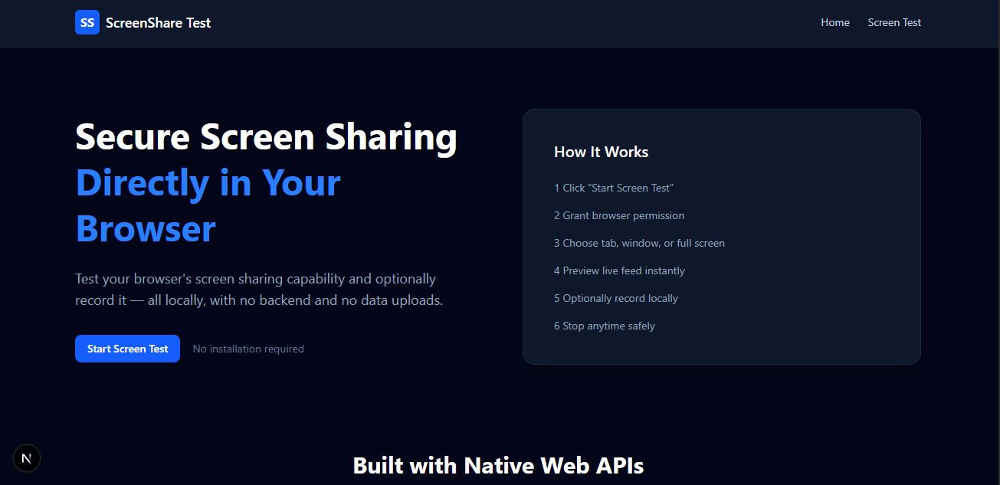

# Screen Share Test App

A browser-based screen sharing and local recording test built using **Next.js, TypeScript, Tailwind CSS, and native Web APIs**.

 **Live Demo:**  
https://screen-sharing-test-beta.vercel.app/

---

##  Preview




---

##  Overview

This application demonstrates:

- Browser screen sharing permissions
- Media stream lifecycle management
- Live screen preview
- Resolution & display surface detection
- Local recording using MediaRecorder
- Proper cleanup and resource handling

All functionality runs locally in the browser.  
No backend. No data uploads.

---

##  Tech Stack

- Next.js (App Router)
- TypeScript
- Tailwind CSS
- Native Web APIs:
  - `navigator.mediaDevices.getDisplayMedia`
  - `MediaRecorder`
  - `MediaStreamTrack.getSettings`
  - `track.onended`

No third-party screen sharing libraries were used.

---

##  Screen Sharing Flow

1. User clicks **Start Screen Test**
2. App verifies browser support
3. Browser permission dialog opens
4. User selects:
   - Tab
   - Window
   - Entire screen
5. App:
   - Displays live preview
   - Extracts resolution via `getSettings()`
   - Detects display surface
6. User can:
   - Record locally
   - Stop sharing anytime
7. Stream cleanup handled automatically

---

##  Recording

- Uses `MediaRecorder`
- Generates temporary `.webm` file
- Allows local download
- Disappears after refresh
- No server storage

---

##  Lifecycle Handling

- Detects manual stop via `track.onended`
- Stops all tracks properly
- Requests fresh stream on retry
- Prevents media leaks
- Cleans up on component unmount

---

##  Browser Support

Tested on:

- Google Chrome (Recommended)
- Microsoft Edge

> Requires HTTPS in production (handled via Vercel).

---

##  Known Limitations

- Safari has limited MediaRecorder support
- `displaySurface` may not be available in all browsers
- Resolution may vary depending on OS scaling
- Screen sharing requires secure context (HTTPS)

---

##  Installation

Clone the repository:

```bash
git clone <https://github.com/Lalitmehra9720/Screen-Sharing-test.git>
cd screen-share-test